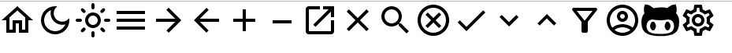

# absui-icons

> Icon Pack for Absolute UI (React)

[](https://www.npmjs.com/package/absui-icons) [](https://standardjs.com)
## Installation

```bash
npm i absui-icons
```
## Usage
```jsx
import {MenuIcon} from 'absui-icons'
const App = () => {
  return <MenuIcon fill="#c0c0c0" size="lg" />
}
```
## Resources
- [Icon Sizes](https://github.com/abschill/absui-icons/blob/master/docs/Size.md)
- [Icon Types](https://github.com/abschill/absui-icons/blob/master/docs/Icons.md)
## License
MIT © [abschill](https://github.com/abschill)
